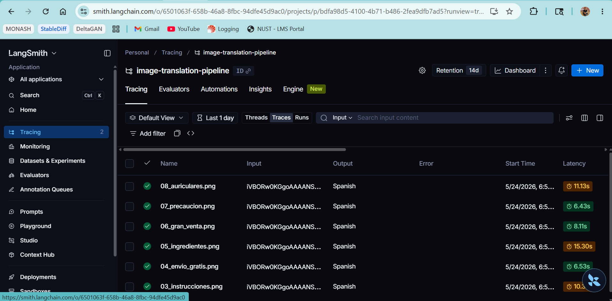
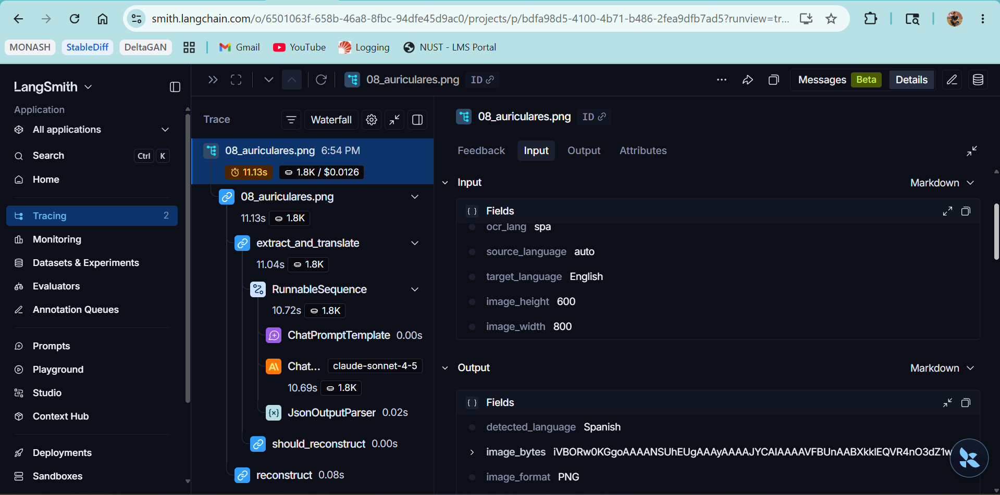

# Image Text Translation Pipeline

## What it does

This API accepts product images containing text in any language, extracts every
visible text region using Claude claude-sonnet-4-5's vision capabilities through a
LangGraph pipeline, translates the text into the requested target language with
natural phrasing (not word-by-word), and returns a new image with the
translated text rendered in-place — preserving the original layout, colours,
and visual structure.

---

## Setup

### Prerequisites

- Python 3.11+
- `uv` package manager — install with:
  ```bash
  curl -LsSf https://astral.sh/uv/install.sh | sh
  ```
- Anthropic API key — [console.anthropic.com/settings/keys](https://console.anthropic.com/settings/keys)
- LangSmith API key (free tier) — [smith.langchain.com](https://smith.langchain.com)

### Installation

```bash
git clone <repo>
cd image-translation-pipeline
uv sync
cp .env.example .env
# Edit .env with your API keys
```

### Running the API

```bash
uv run uvicorn app.main:app --reload
# API available at http://localhost:8000
# Interactive docs at http://localhost:8000/docs
```

---

## Example Requests

```bash
# Returns translated image file (PNG)
curl -X POST "http://localhost:8000/v1/translate-image" \
  -F "image=@sample_images/02_aceite_oliva.png" \
  -F "target_language=English" \
  -F "ocr_lang=spa" \
  --output output.png

# Returns JSON with base64-encoded image (useful for debugging / front-ends)
curl -X POST "http://localhost:8000/v1/translate-image/json" \
  -F "image=@sample_images/02_aceite_oliva.png" \
  -F "target_language=English" \
  -F "ocr_lang=spa"
```

### Running the Batch Script

If you want to process a directory of images locally, a batch script is provided. It automatically saves the translated images and their accompanying JSON metadata to `translated_sample_images/`.

```bash
uv run python translate_sample_images.py --ocr-lang spa
```

Response headers on the binary endpoint:

| Header | Example | Description |
|---|---|---|
| `Content-Disposition` | `attachment; filename="translated_image.png"` | Triggers automatic file download |
| `X-Detected-Language` | `Spanish` | Primary language found in the image |
| `X-Text-Blocks-Found` | `7` | Number of translated text regions |
| `X-Pipeline-Version` | `0.1.0` | API version |

---

## Architecture

### Three-stage LangGraph pipeline

```
[START] → extract_and_translate → (conditional) → reconstruct → [END]
                                               ↘ [END] (on error / no text)
```

**Stage 1 + 2 — Extraction & Translation** (`extract_and_translate` node)

This stage uses a hybrid approach:
1. A Claude `claude-sonnet-4-5` vision call analyses the image and returns a structured JSON object containing every text block with typographic metadata, original text, and an idiomatic translation.
2. `pytesseract` (Tesseract OCR) runs locally to extract pixel-perfect bounding boxes for every word.
3. A robust fuzzy matching algorithm maps the fragmented Tesseract OCR boxes back to Claude's translated paragraphs. This guarantees sub-pixel bounding box accuracy without sacrificing Claude's superior context-aware translation ("Extra Virgin Olive Oil" rather than the word-by-word "Oil Olive Virgin Extra").

**Stage 3 — Image Reconstruction** (`reconstruct` node)

Pure-Python PIL rendering with no generative components:
1. The background color is accurately sampled from the pixel border surrounding the original text block. 
2. A padded solid rectangle in the sampled background color is painted over the original text, cleanly erasing it and any antialiasing bleed.
3. The translated text is rendered on top using the closest available system font (DejaVu → Helvetica → Arial → PIL default). The font is iteratively scaled and word-wrapped to fit precisely within the unpadded, tight Tesseract bounding box, ensuring exact alignment.

---

## Key Design Decisions

**Why Claude claude-sonnet-4-5 for extraction and translation in one call?**
A single vision call returns both the OCR result and the translation
simultaneously, halving latency and cost versus a two-step pipeline. Claude's
multilingual training produces idiomatic translations that respect brand names,
measurements, and formatting conventions — "500 ml" stays "500 ml", "Aceite de
Oliva Virgen Extra" becomes "Extra Virgin Olive Oil" rather than a garbled
literal rendering.

**Why a Hybrid Architecture (Claude + Tesseract OCR)?**
LLM-estimated bounding boxes carry ±5–10% spatial error, leading to squished text and overlapping boxes. However, standard OCR engines (like Tesseract) provide pixel-perfect bounding boxes but lack the intelligence to contextually group words or translate idioms. 
By combining them, we get the best of both worlds: Claude reads the whole image to generate natural, idiomatic translations grouped by logical paragraphs, while Tesseract precisely maps where those paragraphs live on the image. A fuzzy string matcher reconciles the two streams.

**Why PIL over generative inpainting?**
Within prototype scope, PIL offers zero additional cost, zero inference
latency, and a fully explainable, deterministic rendering step that is easy to
unit-test. Generative inpainting (e.g. Stable Diffusion) would produce more
seamless results on textured backgrounds but adds a second model call, GPU
requirements, significant latency, and unpredictable outputs that are harder to
validate.

**Why LangGraph?**
LangGraph's `StateGraph` provides a conditional edge that short-circuits the
reconstruction step when extraction fails — preventing a cascade of confusing
downstream errors. Each node is a plain Python function that can be tested
independently (as seen in `tests/test_pipeline_nodes.py`). The `@traceable`
wrapper on `run_pipeline` combined with LangSmith gives full observability —
input images, extracted JSON, token counts, and latencies — for every
production call.

**Cost note**
The original brief suggested the Gemini free tier. Claude claude-sonnet-4-5 was
chosen instead for tight integration with the LangChain/LangSmith stack and
superior multilingual quality. Estimated cost per image: **$0.01–0.03**
depending on image complexity and the number of text regions returned.

---

## LangSmith Tracing

Every call to `run_pipeline` is decorated with `@traceable(name="image_translation_pipeline")`.
To view traces:

1. Go to [smith.langchain.com](https://smith.langchain.com).
2. Select the project **`image-translation-pipeline`** from the sidebar.
3. Each API request appears as one top-level trace, with child spans for
   `extract_and_translate` and `reconstruct` (when it runs).
4. Click any trace to inspect the input image URI, the raw JSON response from
   Claude, token usage, and per-node latency.

---

## Known Limitations

- **Tesseract dependencies** — requires `tesseract` to be installed on the host OS. Without the proper language packs (e.g., `tesseract-ocr-spa`), it may occasionally fail to match heavily accented text.
- **Font matching** — the pipeline uses DejaVu/Arial/Helvetica as a fallback;
  the original typeface is not detected or matched.
- **Solid background fill** — while intelligent border sampling perfectly blends text boxes on uniform backgrounds, images with complex gradients or heavy textures will still show a visible solid rectangle.
- **Perspective and glare** — real-world photos with strong distortion, glare,
  or low contrast produce lower extraction accuracy.
- **No batching** — the API processes one image per request; bulk translation
  requires multiple sequential calls.
- **Text overflow** — very long translated strings may overflow the bounding
  box even after the auto-shrink algorithm reaches its minimum font size of 8 pt.

---

## What I Would Do With More Time

- **Seamless background reconstruction** — apply OpenCV inpainting
  (`cv2.inpaint`) to fill erased regions using surrounding pixel context
  instead of a flat colour rectangle.
- **Font detection and matching** — integrate a font-recognition API (e.g.
  WhatFont or Adobe Fonts API) to render translated text in the original
  typeface.
- **Async batch endpoint** — add a `POST /translate-batch` endpoint backed by
  Celery + Redis that processes multiple images concurrently and returns a
  job ID for polling.
- **Translation confidence scoring** — expose a `confidence` field per
  `TextBlock`, derived from Claude's own self-assessment or an auxiliary
  cross-check call.
- **Request-level caching** — hash the input image bytes; if the same image
  was processed before, return the cached result without re-running the
  pipeline.

---

## Langsmith Tracability





---

## Running Tests

```bash
uv run pytest tests/ -v
```

All 28 tests run without API keys — external calls are mocked using
`unittest.mock`.
